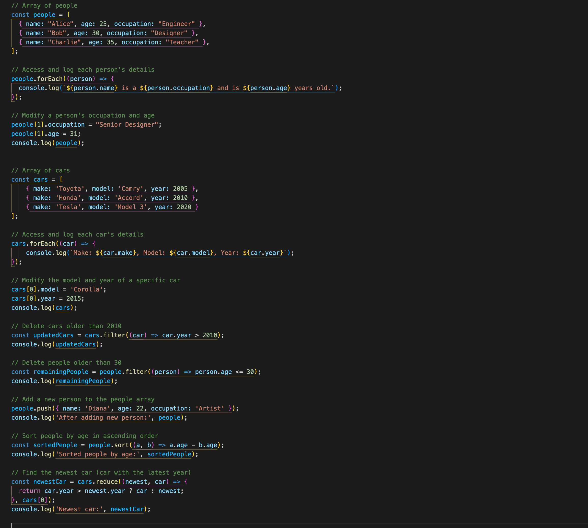

markdown
Copy code
# JavaScript Array Iterations: Accessing, Modifying, and Deleting Objects


## Description 📄
In this assignment, you will practice working with arrays of objects in JavaScript by iterating over their elements, accessing specific values, modifying them, and deleting certain entries. Arrays of objects are a common data structure used in real-world applications to represent collections of related data, such as people, cars, or products.

You will start by working with an array of people objects, each with properties such as `name`, `age`, and `occupation`. You will learn how to loop through this array to access individual object properties, modify their values (like updating someone's age or occupation), and delete objects that meet certain criteria (e.g., removing people over a specific age).

Next, you'll work with an array of cars or other objects, applying the same concepts of accessing, modifying, and deleting properties. The goal of this exercise is to reinforce your understanding of handling arrays of objects, which is critical when managing complex datasets in professional JavaScript projects.

By the end of this assignment, you will be able to:
- Efficiently access and update values within objects inside arrays.
- Add, modify, or delete specific properties based on dynamic conditions.
- Understand the importance of array methods like `forEach`, `map`, and `filter` for iterating through and manipulating arrays of objects.

---

## Expected Project Structure 🏗️

Your project should be structured as follows:

```plaintext
arrays-of-objects-practice/
   app.js
   ```

## Instructions ✅

### 1. **Create the Project Folder and File**
Before starting the coding process, ensure your development environment is prepared.

 - [ ] Create a project folder named `arrays-of-objects-practice` to store your project files.
 - [ ] Inside the arrays-of-objects-practice folder, create a file named `index.js`. This will be your main JavaScript file where all your code will be written.

 ##

### 2. **Array of People: Access and Modify Properties**
In this step, you will create and work with an array of people, where each person is represented by an object with properties such as name, age, and occupation. You will loop through the array to access each person's details, then modify some properties.

 - [ ] Add the following code to your index.js file:

``` javascript

// Array of people
const people = [
    { name: 'Alice', age: 25, occupation: 'Engineer' },
    { name: 'Bob', age: 30, occupation: 'Designer' },
    { name: 'Charlie', age: 35, occupation: 'Teacher' }
];

// Access and log each person's details
people.forEach((person) => {
    console.log(`${person.name} is a ${person.occupation} and is ${person.age} years old.`);
});

// Modify a person's occupation and age
people[1].occupation = 'Senior Designer';
people[1].age = 31;
console.log(people);
```

 - [ ] Run your code using Node.js in the terminal:

``` bash
node index.js
```

**Expected Output:**

``` bash
Alice is a Engineer and is 25 years old.
Bob is a Designer and is 30 years old.
Charlie is a Teacher and is 35 years old.
[
  { name: 'Alice', age: 25, occupation: 'Engineer' },
  { name: 'Bob', age: 31, occupation: 'Senior Designer' },
  { name: 'Charlie', age: 35, occupation: 'Teacher' }
]
```

**Explanation:**

- **Template Literals:**  The code uses template literals (denoted by backticks) in the console.log statement to embed expressions such as `${person.name}`, `${person.occupation}`, and `${person.age}` directly into the string. Template literals provide a cleaner and more readable way to combine strings and variables compared to traditional string concatenation.

- **Iterating with forEach:** The forEach method is used to loop over the array of people. For each person object in the array, the callback function inside forEach is executed, allowing us to access and log each person’s name, occupation, and age. The forEach method does not modify the array; it simply processes each item in the array.

- **Modifying Object Properties:** In the second part, we modify Bob’s occupation and age by directly accessing the `people[1]` object and updating the properties. Arrays in JavaScript are zero-indexed, so `people[1]` refers to Bob (the second object in the array). After modifying the object, logging the people array shows that the changes have been applied.

##

### 3. **Array of Cars: Modify and Delete Entries**
Now, you will create and work with an array of car objects. Each car has attributes such as make, model, and year. You will loop through the array to access and modify certain properties, and then practice deleting specific entries based on conditions (e.g., removing old cars).

 - [ ] Add the following code to your index.js file:

```javascript
// Array of cars
const cars = [
    { make: 'Toyota', model: 'Camry', year: 2005 },
    { make: 'Honda', model: 'Accord', year: 2010 },
    { make: 'Tesla', model: 'Model 3', year: 2020 }
];

// Access and log each car's details
cars.forEach((car) => {
    console.log(`Make: ${car.make}, Model: ${car.model}, Year: ${car.year}`);
});

// Modify the model and year of a specific car
cars[0].model = 'Corolla';
cars[0].year = 2015;
console.log(cars);

// Delete cars older than 2010
const updatedCars = cars.filter((car) => car.year > 2010);
console.log(updatedCars);
```

 - [ ] Run your code using Node.js in the terminal:
 
```bash
node index.js
```

**Expected Output:**

```bash
Make: Toyota, Model: Camry, Year: 2005
Make: Honda, Model: Accord, Year: 2010
Make: Tesla, Model: Model 3, Year: 2020
[
  { make: 'Toyota', model: 'Corolla', year: 2015 },
  { make: 'Honda', model: 'Accord', year: 2010 },
  { make: 'Tesla', model: 'Model 3', year: 2020 }
]
[
  { make: 'Tesla', model: 'Model 3', year: 2020 }
]
```

**Explanation:**

- **Accessing Object Properties:** The forEach loop is used to iterate over the array of cars and access each car's make, model, and year properties. Just like in the previous example, we use template literals to make the output more readable.

- **Modifying Object Properties:** Here, we modify the first car in the array (the Toyota) by changing its model from 'Camry' to 'Corolla' and updating its year to 2015. By directly assigning new values to cars[0].model and cars[0].year, we can modify the properties of an object in the array.

- **Filtering Arrays:** The filter method is used to create a new array, updatedCars, containing only the cars with a year greater than 2010. The filter method iterates over the array and applies the given condition (in this case, car.year > 2010). Only the cars that satisfy the condition are included in the new array. This method is useful for removing or selecting specific objects based on conditions, without modifying the original array.

##

### 4. **Deleting Specific People: Filter Method**
You will now apply the same filter method used in the cars example to delete people from the people array based on specific conditions. In this case, let’s remove people who are older than 30.

 - [ ] Add the following code to your index.js file:

```javascript
// Delete people older than 30
const remainingPeople = people.filter((person) => person.age <= 30);
console.log(remainingPeople);
```

 - [ ] Run your code using Node.js in the terminal:

```bash
node index.js
```

**Expected Output:**

```bash
[
  { name: 'Alice', age: 25, occupation: 'Engineer' },
  { name: 'Bob', age: 31, occupation: 'Senior Designer' }
]
```

**Explanation:**

- **Filter Method for Deletion:** The filter method is an efficient way to remove elements from an array based on a specific condition. In this case, we are filtering out any people older than 30 by using the condition person.age <= 30. The result is a new array (remainingPeople) that only contains the people who meet the age requirement.

##

## 5. **Add New Person and Sort People by Age**
In this step, you will add a new person to the people array and then sort the array based on the age of each person in ascending order.

- [ ] Add the following code to your `index.js` file:

```javascript
// Add a new person to the people array
people.push({ name: 'Diana', age: 22, occupation: 'Artist' });
console.log('After adding new person:', people);

// Sort people by age in ascending order
const sortedPeople = people.sort((a, b) => a.age - b.age);
console.log('Sorted people by age:', sortedPeople);
```

 - [ ] Run your code using Node.js in the terminal:

```bash
node index.js
```

**Expected Output:**

```bash
After adding new person: 
[ 
  { name: 'Alice', age: 25, occupation: 'Engineer' },
  { name: 'Bob', age: 31, occupation: 'Senior Designer' },
  { name: 'Charlie', age: 35, occupation: 'Teacher' },
  { name: 'Diana', age: 22, occupation: 'Artist' }
]

Sorted people by age: 
[ 
  { name: 'Diana', age: 22, occupation: 'Artist' },
  { name: 'Alice', age: 25, occupation: 'Engineer' },
  { name: 'Bob', age: 31, occupation: 'Senior Designer' },
  { name: 'Charlie', age: 35, occupation: 'Teacher' }
]

```

**Explanation:**

- **Adding Elements:** The push method adds a new object (Diana) to the people array. push() is a method that appends one or more elements to the end of an array and returns the new length of the array.

- **Sorting by Age:** The sort method is used with a comparison function (a, b) => a.age - b.age that orders people by their age in ascending order.

  -  When the function returns a negative value (a.age - b.age), a comes before b.
  -  When the function returns a positive value, b comes before a.

- **In-Place Sorting:** The sort method modifies the original array in place, so after sorting, the original array is rearranged based on the comparison logic provided.

##

## 6. **Find the Newest Car**
Now you will find the newest car from the cars array by identifying the car with the most recent year.

- [ ] Add the following code to your `index.js` file:

```javascript
// Find the newest car (car with the latest year)
const newestCar = cars.reduce((newest, car) => {
  return car.year > newest.year ? car : newest;
}, cars[0]);
console.log('Newest car:', newestCar);
```

 - [ ] Run your code using Node.js in the terminal:

```bash
node index.js
```

**Expected Output:**

```bash
Newest car: { make: 'Tesla', model: 'Model 3', year: 2020 }
```

**Explanation:**

- **Finding the Newest Car:** The reduce method is used to find the car with the highest year value in the cars array.

  - Reduce iterates over the array, comparing each car's year to the current newest car.
  - If the current car's year is greater than the newest car's year, the current car becomes the new newest.

- **Starting with the First Element:** The second argument to reduce, cars[0], initializes the first car as the "newest" car. The iteration starts with this car, and it is updated if a newer car is found during the iteration.

- **Comparison Logic:** The comparison car.year > newest.year ? car : newest checks if the current car has a higher year. If true, the current car is returned; otherwise, the current newest car is retained.

- **Accumulative Process:** The reduce method carries the result from one iteration to the next, which is useful for finding max or min values within an array.

##

## Conclusion 📄

In this assignment, you learned how to work with arrays of objects in JavaScript by accessing, modifying, and deleting values. You applied key concepts such as using the forEach method for iteration, template literals for cleaner string formatting, and the filter method for selective filtering or deletion of objects.

**Key Takeaways:**
- **Accessing Object Properties:** You can access values in an object using dot notation (e.g., person.name).
- **Using forEach:** This array method allows you to loop over each element in an array and perform actions, like logging values.
- **Modifying Values:** Objects within arrays can be modified by accessing them with array indexing and dot notation.
- **Filtering Arrays:** The filter method is essential for creating a new array of elements that meet a specific condition, without modifying the original array.

### Solution codebase 👀
🛑 **Only use this as a reference** 🛑

💾 **Not something to copy and paste** 💾

**Note:**  This lab references a solution file located [here](https://github.com/HackerUSA-CE/aisd-jse-06-arrays-2/tree/solution) (link not shown).


---

© All rights reserved to ThriveDX